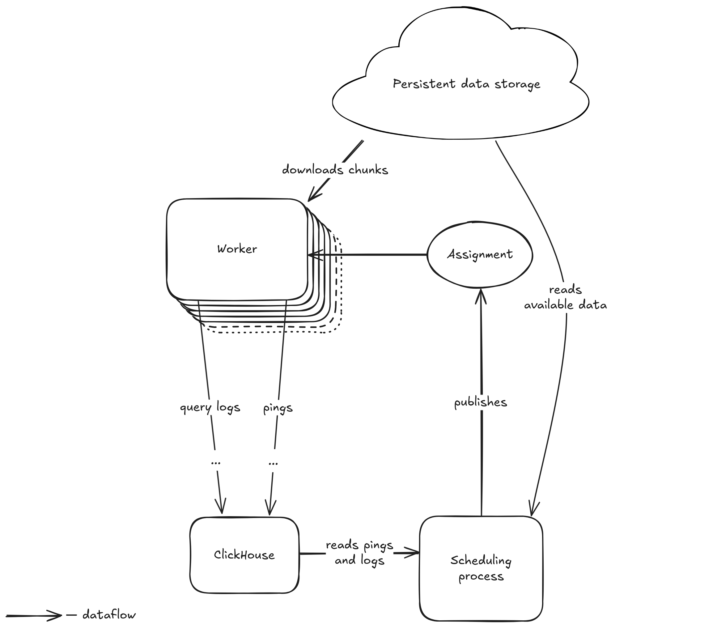

# Assignment lifecycle

 

## Publishing assignments

Once generated, a single file with assignments for all the Workers is published to a persistent storage under a unique content-addressable URL.
Another file under a well-known URL is updated to point to that assignment URL.

Example content of the `network-state.json`:
```json
{
  "assignment": "https://metadata.sqd-datasets.io/assignment_mainnet_20241008T141245_242da92f7d6c.json.gz"
}
```

The URL of the network state at this stage is provided with the Worker config.

The Workers check that file for updates every minute and if it points to a new assignment, download and start using it.

Portals also download this file to be able to parse [Pings](04_network_communication.md#pings) coming from Workers.

> Later, to switch to IPFS storage, the assignment may be published to the IPFS and it’s hash reference will be posted to a smart contract that is polled by the Workers.

> Note that if we replace the current Scheduler with this mechanism before migrating datasets to BitTorrent distribution, we should also take care of distributing Cloudflare signatures that allow fetching the datasets via HTTPS.

## Assignment format

The assignment is a JSON file with two sections.

* The list of all known chunks split by datasets. The chunks are enumerated in the order they follow in the assignments file.
* Individual assignments for the workers. Each assignment is represented by a delta-encoded array with indexes of the assigned chunks from the global chunk list.

With 2,000 workers and 500,000 assigned chunks the size of this file gzipped will be less than 20 MB.

If it grows too big, we can split it into a chunk list and assignments in different files.

### Why?

There is not much difference (5% uncompressed, 1.2% gzipped) between proto and JSON sizes, so JSON is chosen for simplicity and readability.

Chunk names and file urls have a lot of repetitions, so a compression gives good results and almost fully mitigates the necessity to avoid those repetitions manually by inventing any string building patterns.

```none
s3://solana-mainnet-1/0221000000/0221000000-0221000649-9QgFD/balances.parquet
s3://solana-mainnet-1/0221000000/0221000000-0221000649-9QgFD/blocks.parquet
s3://solana-mainnet-1/0221000000/0221000000-0221000649-9QgFD/instructions.parquet
s3://solana-mainnet-1/0221000000/0221000000-0221000649-9QgFD/logs.parquet
s3://solana-mainnet-1/0221000000/0221000000-0221000649-9QgFD/rewards.parquet
s3://solana-mainnet-1/0221000000/0221000000-0221000649-9QgFD/token_balances.parquet
s3://solana-mainnet-1/0221000000/0221000000-0221000649-9QgFD/transactions.parquet
s3://solana-mainnet-1/0221000000/0221000650-0221001299-Bfz4q/balances.parquet
s3://solana-mainnet-1/0221000000/0221000650-0221001299-Bfz4q/blocks.parquet
s3://solana-mainnet-1/0221000000/0221000650-0221001299-Bfz4q/instructions.parquet
s3://solana-mainnet-1/0221000000/0221000650-0221001299-Bfz4q/logs.parquet
s3://solana-mainnet-1/0221000000/0221000650-0221001299-Bfz4q/rewards.parquet
s3://solana-mainnet-1/0221000000/0221000650-0221001299-Bfz4q/token_balances.parquet
s3://solana-mainnet-1/0221000000/0221000650-0221001299-Bfz4q/transactions.parquet
```

However, listing a single download URL per chunk and listing its files separately (instead of listing all individual full file URLs) saves about half of the compressed size. So the above list becomes:

```json
"chunks": [
  {
    "id": "0221000000/0221000000-0221000649-9QgFD",
    "url": "https://solana-mainnet-1.sqd-datasets.io/0221000000/0221000000-0221000649-9QgFD",
    "files": [
      "blocks.parquet",
      "balances.parquet",
      "instructions.parquet",
      "logs.parquet",
      "rewards.parquet",
      "token_balances.parquet",
      "transactions.parquet"
    ]
  },
  {
    "id": "0221000000/0221000650-0221001299-Bfz4q",
    "url": "https://solana-mainnet-1.sqd-datasets.io/0221000000/0221000650-0221001299-Bfz4q",
    "files": [
      "blocks.parquet",
      "balances.parquet",
      "instructions.parquet",
      "logs.parquet",
      "rewards.parquet",
      "token_balances.parquet",
      "transactions.parquet"
    ]
  }
]
```

The numbers in the comparison table are in millions of bytes.

| Chunks list format | Proto uncompressed | JSON uncompressed | Proto gzipped | JSON gzipped |
|----|----|----|----|----|
| Reuse all repeating strings | 25.5 | 21 | 5.7 | **5.8** |
| URL per chunk + filenames list per bucket | 66.5 | 70 | 7.7 | **7.8** |
| **URL and filenames list per chunk** | - | 150 | - | **8.2** |
| List all files’ urls | - | 383 | - | **19.4** |

## Example

Sample contents of `https://metadata.sqd-datasets.io/assignment_mainnet_20241008T141245_242da92f7d6c.json.gz`:

```json
{
  "datasets": [
    {
      "id": "czM6Ly9zb2xhbmEtbWFpbm5ldC0x",
      "chunks": [
        {
          "id": "0221000000/0221000000-0221000649-9QgFD",
          "url": "https://solana-mainnet-1.sqd-datasets.io/0221000000/0221000000-0221000649-9QgFD",
          "files": [
            "blocks.parquet",
            "balances.parquet",
            "instructions.parquet",
            "logs.parquet",
            "rewards.parquet",
            "token_balances.parquet",
            "transactions.parquet"
          ]
        },
        {
          "id": "0221000000/0221000650-0221001299-Bfz4q",
          "url": "https://solana-mainnet-1.sqd-datasets.io/0221000000/0221000650-0221001299-Bfz4q",
          "files": [
            "blocks.parquet",
            "balances.parquet",
            "instructions.parquet",
            "logs.parquet",
            "rewards.parquet",
            "token_balances.parquet",
            "transactions.parquet"
          ]
        },
        ...
      ]
    }
  ],
  "worker_assignments": {
      "12D3KooWBwbQFT48cNYGPbDwm8rjasbZkc1VMo6rCR6217qr165S": {
          "chunks_deltas": [0, 2, 1]
      },
      "12D3KooWPobpo6s1hk6c8cREUhnSRT87mXr39FpeZ3Cr2Su5czds": {
          "chunks_deltas": [0, 1, 1, 1]
      }
  }
}
```


