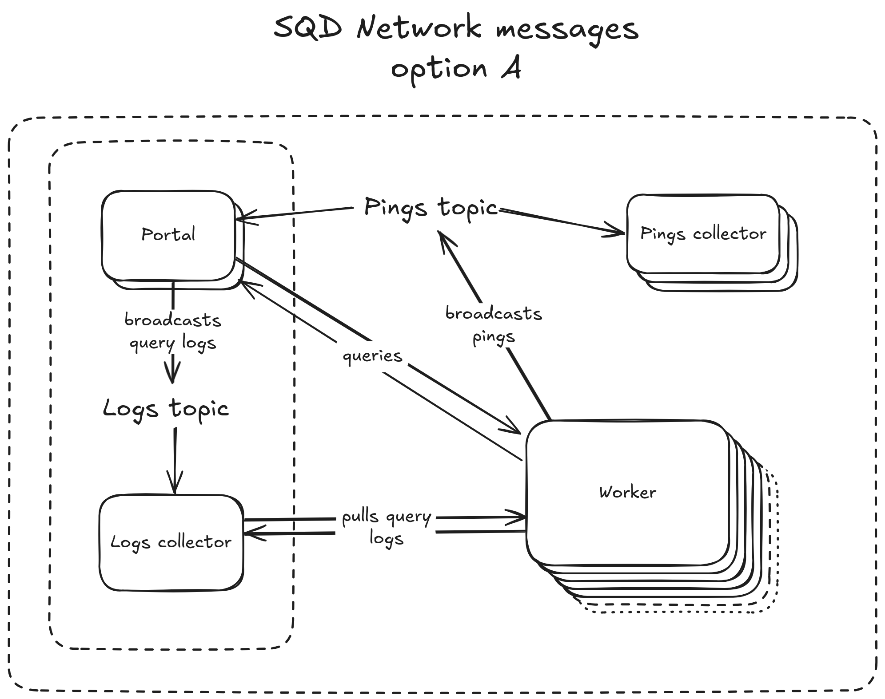
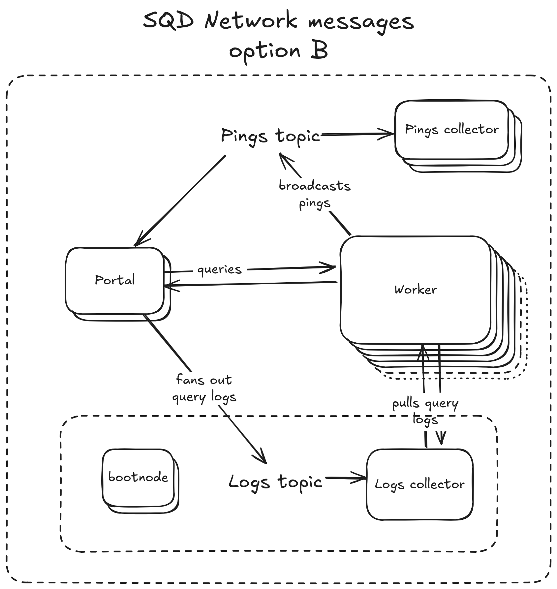

# Network communication

# Transport layer: libp2p

The Network communication is based on the [libp2p](https://libp2p.io/). It implies that:

* Each node in the Network is associated with a unique [Peer ID](https://docs.libp2p.io/concepts/fundamentals/peers/). Peer IDs are encoded public keys represented by 73-byte structs in memory and serialized into 52-byte base58 strings.
* Peer authentication is done on the protocol level. If the handler code receives a message with a Peer ID, it can be sure that it has been sent by the owner of the private key associated with that Peer ID.
* Streams are multiplexed internally, so all the p2p communication happens on a single UDP port and there is only one physical connection per peer, even if there are dozens of communication channels open.

## Pubsub protocol

There is a comprehensive guide in libp2p Docs: <https://docs.libp2p.io/concepts/pubsub/overview/>

Basically, this protocol allows broadcasting a message to all the nodes subscribed to the topic.

Each message is wrapped in the [following struct](https://github.com/libp2p/rust-libp2p/blob/8ceadaac5aec4b462463ef4082d6af577a3158b1/protocols/gossipsub/src/types.rs#L99):

```rust
pub struct RawMessage {
    pub source: Option<PeerId>,
    pub data: Vec<u8>,
    pub sequence_number: Option<u64>,
    pub topic: TopicHash,
    pub signature: Option<Vec<u8>>,
    pub key: Option<Vec<u8>>,
    pub validated: bool,
}
```

## Request-response communication

Two nodes can participate in this type of communication. One of them acts as the “client” and initiates the request, and another acts as a “server”. Note that any node can act as a client for some requests and as a server for other requests.

## Kademlia DHT

There is a Distributed Hash Table protocol supported by libp2p, but it should not be used in the Network.

## NAT limitations

See this [page](https://docs.libp2p.io/concepts/nat/hole-punching/) (and this [blog post](https://tailscale.com/blog/how-nat-traversal-works)) about why connections between peers behind NAT are not straightforward.

In short, without hosting relay servers, it’s not possible to use a node behind NAT as a request server. Therefore, we have to ensure that such components as Workers and Bootnodes have a public IP without NAT.

## Open questions:

* How many nodes can co-exist in the p2p network without any troubles?
* What happens when multiple nodes join the network?
* What happens when multiple nodes leave the network?
* Can an anonymous (not [whitelisted](05_node_registration.md)) node destabilize the network?
* In what ways can a whitelisted node destabilize the network?
* How long does it take for a gossipsub message to propagate to 95% of nodes if the network has 100/1k/10k nodes?
* How much latency is “reserved” by transport layer encoding, encrypting and other message processing?
* How does libp2p request-response communication relate to the default HTTP requests in terms of performance? What stages does the message pass through?
* Do we get the sender’s address with the gossipsub broadcasted messages?
* Can a request “server” find out whether the response is received successfully?
* Are we using QUIC’s [built-in encryption](https://docs.libp2p.io/concepts/transports/quic/#quic-in-libp2p) instead of the Noise protocol?
* Can we use AutoNAT to emit a warning if the Worker is not publicly available?
* Can we use the [fan-out](https://docs.libp2p.io/concepts/pubsub/overview/#fan-out) mechanism as a channel with a small number of subscribers?
* Are the messages authenticated in the request-response communication? Can we extract the signatures?

# Communication protocol

 
 
 

## Pings

### Publisher: Worker

Each Worker periodically (once every 55s) broadcasts its state to the `pings` topic. In particular, it contains a set of available chunks represented as a bit string referencing the latest (linked) public assignment file.

```rust
message Ping {
  // e.g. "https://metadata.sqd-datasets.io/assignment_mainnet_3e8deeb7c06775f601523ca8cc58b.json.gz"
  string assignment_id = 1;
  // Points to chunks in the global chunks list referenced by `assignment_id`.
  // 1 on the i-th position means that the i-th chunk is available.
  BitString available_chunks = 2;
  string version = 3;  // e.g. "1.0.0"
  uint64 stored_bytes = 4;
  optional uint64 available_bytes = 5;
}

message BitString {
  // Elias-Fano encoding
}
```

The size of the [Elias-Fano](https://en.wikipedia.org/wiki/Shannon%E2%80%93Fano%E2%80%93Elias_coding) encoded bit-string is approximately `k log(n/k)` bits, where `k` is the number of ones and `n` is the total length. So if there are 1M chunks in total and a Worker has 10,000 chunks, its Ping size will be about 10 KB.

Each node listening for the Pings topic (it necessarily includes those which are publishing to the topic) will have about 1-2 MB/s Ping traffic if there are 10,000 Workers in the Network.

> **Call to discussion: further compression**
>
> \
> If the worker references assigned chunks instead of all existing chunks in this bitmask (so that it becomes all ones when it’s done with the downloads), its size can be reduced about 6-7 times. However, it will cause multiple complications for readers:
>
> * Portals will have to store all the assignments, meaning 2-3 times more data than just a list of existing chunks.
> * Worker will have no way to communicate that it has (for whatever reason) some extra chunks, not included in its current assignment.
>
> \
> Do you think it’s worth it?

### Subscriber: Portals

Portals subscribe to the Pings topic to discover the Workers and read their available chunks. For each Worker, the Portal remembers the address included in its latest Ping to send queries to it later. It also allows filtering by Worker’s version.

### Subscriber: Ping Collector

Ping Collectors subscribe to the Pings topic and write all the Pings they receive to the database (ClickHouse), filtering duplicates on the DB level.

### Subscriber: Logs Collector

Logs Collectors listen to the Pings to discover existing Workers and save their addresses to [send requests](04_network_communication.md#client-logs-collector).

## Queries

Queries are sent from Portals to Workers in the request-response fashion.

### Client: Portal

If the Portal wants to query the Worker, it uses it’s saved address from the last received Ping to open a connection (or use an existing one). It then generates a unique query ID (UUIDv4), sends a signed `Query` message and waits for the response or a timeout.

```rust
message Query {
  string query_id = 1;
  string dataset = 2;  // "czM6Ly9ldGhlcmV1bS1tYWlubmV0"
  oneof query_repr {
    string query = 3;
    bytes query_gzipped = 4;
  }
  // If present, these values should be used instead of from_block and to_block in the query contents
  optional Range block_range = 5;
  
  uint32 timestamp_ms = 6;
  bytes signature = 7;
}
```

The Portal may specify the overriding `block_range` in this message to pass the original query string without modification.

Queries contain a signature of the Portal that is later sent with Worker logs to prove that it didn’t mint an artificial request. It also ties the query_id with the input parameters sufficient to reproduce the result. See [Logs validation](09_logs_validation.md) for details. The message to sign is formed like this:

```none
{query_id},{worker_id},{timestamp},{query_hash},{dataset},{block_range}
```

### Server: Worker

The Worker accepts any incoming messages from [valid peers](05_node_registration.md), checks the [rate limit](06_compute_units_allocation.md) for this peer, verifies the [signature](09_logs_validation.md) of the message (including timestamp validity), and then tries to process the query against the data chunk in its local storage.

* On error, the Worker sends back the message containing the error description.
* On success, the Worker sends back the query response together with the last block included in the response. If the result doesn’t cover the entire requested range, the client may want to send another request using this last block number.

```rust
message QueryResult {
  string query_id = 1;
  oneof result {
    OkResult ok = 2;
    string bad_request = 3;
    string server_error = 4;
    Empty no_allocation = 5;  // may be renamed to `too_many_requests`
    string timeout = 7;
  }
}

message OkResult {
  bytes data = 1;
  optional uint64 last_block = 2;
  QueryResultSummary summary = 3;
}

message QueryResultSummary {
  optional uint32 size = 1;
  bytes hash = 2;
  bytes signature = 3;  // signs "{query_id},{hash}"
}
```

Note that Workers [must have a public IP](#nat-limitations) to be able to receive requests.

Upon receiving the result, the client should keep its signature and send it with logs (see below).

## Worker logs

### Client: Logs Collector

Logs Collectors discover the existing Workers using [Pings](#subscriber-logs-collector) and regularly send requests to collect the saved logs. The exact process is described on [this page](08_collecting_query_logs.md).

```rust
message RequestLogs {
  uint64 last_seq_no = 1;
}
```

### Server: Worker

Workers receive the `RequestLogs` requests and respond with a bundle of query logs. Each log message contains the full [Query](#client-portal) (including the client signature) and some additional statistics. All the fields except the input query have the fixed size.

```rust
message QueryLogs {
  repeated QueryExecuted queries_executed = 1;
}

message QueryExecuted {
  string client_id = 1;
  string worker_id = 2; // remove?

  Query query = 3;

  oneof result {
    QueryResultSummary ok = 7;
    string bad_request = 8;
    string server_error = 9;
  }
 
  optional uint32 exec_time_ms = 6;
  optional uint64 seq_no = 10;
  optional uint64 timestamp_ms = 11;
}
```

## Client (Portal) logs

Collecting client logs is more complicated because clients may be [behind NAT](#nat-limitations) and can’t be reliably used as request servers. However, these logs are purely informational, and losing some of them is affordable.

The client logs are broadcasted to the pub-sub topic for anyone interested in them to listen for. This allows adding new Logs Collectors without affecting the existing Portals.

Every participant of the topic **rate limits** the number of forwarded messages to not overload the Network.

### Publisher: Portals

Depending on whether libp2p allows [fan-outs](https://docs.libp2p.io/concepts/pubsub/overview/#fan-out) to the topic with a few subscribers, there are two options:

* Option A: Portals participate in the topic, forwarding its messages, and just publish the messages to it.
* Option B: Portals [fan-out](https://docs.libp2p.io/concepts/pubsub/overview/#fan-out) their logs to the topic subscribers and don’t participate in message forwarding themselves.

If possible, Option B should be preferred.

There are two kinds of client logs to be published: “query submitted” and “query finished”.

> Do we need QuerySubmitted logs? What do they tell us except the number of unsuccessfull queries, which we won’t know anyway because the logs collection itself is lossy?

```rust
message QuerySubmitted {
  string client_id = 1; // remove?
  string worker_id = 2;
  string query_id = 3;

  string dataset = 4;
  oneof query_repr {
    string query = 5;
    bytes query_gzipped = 6;
  }
  bytes query_hash = 7; // remove?
}

message QueryFinished {
  string client_id = 1; // remove?
  string worker_id = 2;
  string query_id = 3;

  uint32 total_time_ms = 4;
  oneof result {
    QueryResultSummary ok = 5;
    string bad_request = 6;
    string server_error = 7;
    google.protobuf.Empty no_allocation = 8;
    string timeout = 9;
  }
}
```

### Subscriber: Logs Collector

Logs Collectors listen for incoming query logs from Portals and store them in the DB (ClickHouse) filtering duplicates on the DB level.

Later, these logs may be used for [response validation](09_logs_validation.md).