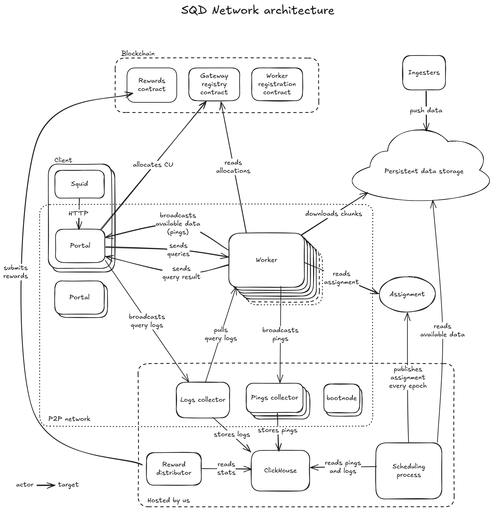

# SQD Network Architecture

# This RFC page

This page and subpages describe the desired state of the network, without covering the details on how to achieve that from the current state. However, there are notes left to indicate which parts differ from the current (September 2024) implementation.

# Overall architecture diagram

 

# Goals

This document has been designed with the following limits in mind. The Network may continue working beyond those, but there are no guarantees, so a new design iteration should be conducted at that point.

* 10,000 workers, storing 1 TB each
* 500 datasets with 1,000,000 chunks and 100 TB of data in total
* 1,000 portals

# Network components (briefly)

## Worker

A Worker is a core service that downloads assigned data chunks from the persistent data storage and processes incoming data queries over the downloaded data chunks.

## Portal (network gateway)

Acts as an HTTP proxy between the client (usually a Squid) and the Network. It sends queries to the Network and receives responses. The number of queries that can be sent is limited by the compute units allocated in exchange for SQD token locking.

## Bootnode

The simplest possible passive node with a well-known address that allows other nodes to bootstrap the discovery process when joining the Network.

## Logs collector

A node trusted by workers that collects query logs from both Workers and Portals and stores them in the DB for future use.

## Pings collector

A node that passively listens for pings being broadcasted in the Network and stores them in the DB for future use.

## Scheduler

A regular process that analyzes the current Network state and distributes data chunks among the workers to achieve data availability.

> Currently, the scheduler is a centralized and critical participant of the Network.

## Data storage

A source of data prepared by SQD team to be distributed and used by the Network. The exact storage used is not important because of how the data is distributed (see [Data delivery](#data-delivery)).

# Network processes

## Data ingestion (not covered)

## [Scheduling algorithm (WIP)](01_scheduling_algorithm.md)

## [Assignment lifecycle](02_assignment_lifecycle.md)

## [Data delivery](03_data_delivery.md)

## [Network communication](04_network_communication.md)

## Metadata specification (not covered)

## [Node (worker/portal) registration](05_node_registration.md)

## [Compute units](06_compute_units_allocation.md)

## [Sending queries (WIP)](07_sending_queries.md)

## [Collecting query logs](08_collecting_query_logs.md)

## [Logs validation](09_logs_validation.md)

## [Distributing rewards (WIP)](10_distributing_rewards.md)
