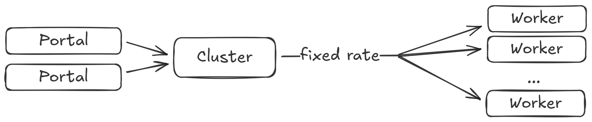
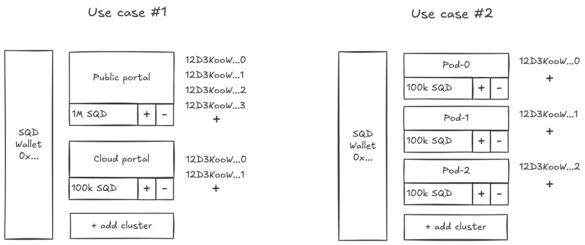

# PortalRegistry contract

This document describes high-level mechanics of how the new `PortalRegistry` contract should work.

## Design goals

This contract enables [portal-worker](../network-rfc/README.md#network-components-briefly) communication at a limited request rate in return for locking SQD tokens.

Workers accept queries from the portals registered in this contract while the tokens are locked. The more SQD is locked, the higher the rate limit is, calculated in abstract **compute units** (CUs). The fixed amount of locked compute units allows a constant request rate to the worker network, distributed among all workers.

#### Portal clusters

Portals are grouped into **clusters** sharing a single CU pool. Multiple peer IDs can be added to the cluster. Each cluster has its own amount of locked SQD and corresponding compute unit allocation. Each portal in the cluster can query workers, but the rate limit is shared among all portals in the cluster.



## Use cases

**Direct usage** — users with sufficient tokens can register a portal and begin using it.

**Borrowing pools** (TODO: add a link) — smart contracts for borrowing pools are built on top of this contract.

## Comparison to the previous version

Compared to the [`GatewayRegistry`](https://github.com/subsquid/subsquid-network-contracts/blob/6623bea612586d2047d1a561ca740046664357a1/packages/contracts/src/GatewayRegistry.sol) contract, this version
- supports multiple portal clusters managed by a single wallet,
- drops the notion of epochs,
- drops the notion of CU boosts,
- allows gradual unstaking instead of fixed time unlocks
- enables a fee switch

## Mechanics

### Locking tokens

Every SQD token stored in the contract is (virtually) in one of three states:
- **Active** — the token is used by an active portal to secure compute units
- **Locked** — a withdrawal was requested and the token is not used for CU computation now
- **Transferable** — the token is sitting in the contract and can be withdrawn at any moment

When an operator wants to stop a portal and unlock tokens, only a limited amount is unlocked immediately; the remaining tokens are set to the _locked_ state.
They are then converted from _locked_ to _transferable_ at the fixed rate per block. Transferable tokens can be claimed by calling `withdraw`.
This is needed to prevent immediate massive withdrawals.

> The implementation just stores the last block at which the amounts were updated and recalculates how many tokens have been unlocked at the time of the contract call.

When allocating tokens to a cluster (making them _active_), tokens from the _locked_ balance are used first, followed by _transferable_ tokens. This allows restaking tokens between clusters without any limitations.

Additionally, the user may request to withdraw some _locked_ tokens immediately by paying a fee. This allows quickly freeing up tokens if needed.

#### Interaction with portal pools

The borrowing pool contract will need to withdraw funds from this contract.
If this contract allows $Q$ tokens to be withdrawn per block and someone owns $k\%$ of the pool, they can withdraw $k / 100 \times Q$ per block, guaranteeing that even if everyone starts to withdraw at the same time, they won't hit the limit of the `PortalRegistry` contract.


### Registration

Each wallet can own multiple portal clusters. Each cluster has its own stake and set of peer IDs registered in it.

This allows running multiple portals with isolated compute unit pools.



### Allocation strategies

By default, if $S$ compute units are allocated to a portal cluster, each worker receives $S / N$ compute units, where $N$ is the number of workers in the network. Custom allocation strategies may be supported in the future, just like in the previous `GatewayRegistry` contract.

## Public API

Here is an approximate API for the core functions. Additional functions may be added by the implementation.

```ts
type PeerId = string;
type ClusterId = string;

type PortalCluster = {
    cluster_id: ClusterId,
    peer_ids: PeerId[],
    compute_units: number,
}

function getPortalClusters(worker_id: PeerId): PortalCluster[]
function getActivePortals(): PeerId[]

function stake(amount: number): ClusterId
function createCluster(): ClusterId
function addStake(clusterId: ClusterId, amount: number)
function removeStake(clusterId: ClusterId, amount: number)
function register(peerIds: PeerId[], clusterId: ClusterId)
function unregister(peerIds: PeerId[])
function transferableAmount(): number
function withdraw()
function withdrawImmediate(amount: number)

function getComputeUnitsPerToken(): number
function getMinStake(): number
function getWithdrawalLimitPerBlock(): number
function getImmediateWithdrawalAllowance(): number

function setComputeUnitsPerToken(n: number)
function setMinStake(tokens: number)
function setWithdrawalLimitPerBlock(tokensPerBlock: number)
function setImmediateWithdrawalAllowance(tokens: number)
function setMaxPortalsPerCluster(n: number)
function setMaxClustersPerWallet(n: number)
function setWithdrawalFee(ratio: number)
function setImmediateWithdrawalFee(ratio: number)
```

### Worker API

#### `getPortalClusters`

Each worker periodically reads the contract state via RPC to determine how many CUs each active portal cluster currently has allocated _to this worker_. The numbers may be different for different workers if a custom [allocation strategy](#allocation-strategies) is used.

#### `getActivePortals(): PeerId[]`

Returns the list of all currently active portal peer IDs registered in the contract. The portal is considered active if its cluster has at least the minimum required stake.

This will be used to whitelist the peers in the network.

### Portal operator API

#### `createCluster(): ClusterId`

Creates a new cluster with a globally unique ID generated by the contract.
The caller is set to be the owner of this cluster.

The cluster is created with no peer IDs assigned to it.

#### `addStake(clusterId: ClusterId, amount: number)`

The `amount` of SQD tokens is transferred along with this call and is stored on the contract in the [_active_](#locking-tokens) state, assigned to the specified cluster.

#### `stake(amount: number): ClusterId`

A convenience method to create a new cluster and add stake to it immediately.

#### `removeStake(clusterId: ClusterId, amount: number)`

Requests withdrawal of the specified amount of tokens from the given cluster.
Those tokens are immediately moved to the _locked_ state affecting the compute units allocation.

#### `register(peerIds: PeerId[], clusterId: ClusterId)`

Adds one or more peer IDs to the cluster. The contract should check that each peer ID is in the correct format and not yet registered.

#### `unregister(peerIds: PeerId[])`

Removes one or more previously registered peer IDs from their cluster.

#### `transferableAmount(): number`

Returns how many tokens are in the _transferable_ state and can be withdrawn immediately in the current block.

#### `withdraw()`

Withdraws all _transferable_ tokens to the caller's wallet.

#### `withdrawImmediate(amount: number)`

Withdraws the specified amount of _locked_ tokens immediately to the caller's wallet, subject to the immediate withdrawal fee.

The collected fee is sent to the contract owner.

### Admin API

#### `setComputeUnitsPerToken(n: number)`

Sets how many compute units are allocated per single SQD token locked in the contract.

#### `setMinStake(tokens: number)`

Sets the minimum amount of tokens required for the portal to be active.

If the cluster's stake is below this value, it's granted zero compute units and is not returned by `getActivePortals`.

#### `setWithdrawalLimitPerBlock(tokensPerBlock: number)`

Sets how many tokens convert from _locked_ to _transferable_ state per block.

#### `setImmediateWithdrawalAllowance(tokens: number)`

Sets how many tokens are moved to the _transferable_ state immediately upon the withdrawal request.

#### `setMaxPortalsPerCluster(n: number)`

Sets the maximum number of peer IDs that can be registered in a single cluster.

#### `setMaxClustersPerWallet(n: number)`

Sets the maximum number of clusters that can be created by a single wallet.

#### `setWithdrawalFee(ratio: number)`

Sets the fee ratio (e.g., `0.01` for 1%) applied to all withdrawals from the contract. The fee is deducted from the withdrawn amount and sent to the contract owner.

The contract is initialized with zero.

#### `setImmediateWithdrawalFee(ratio: number)`

Sets the fee ratio (e.g., `0.2` for 20%) applied to every [immediate withdrawal](#withdrawimmediateamount-number) from the contract. The fee is deducted from the withdrawn amount and sent to the contract owner.
