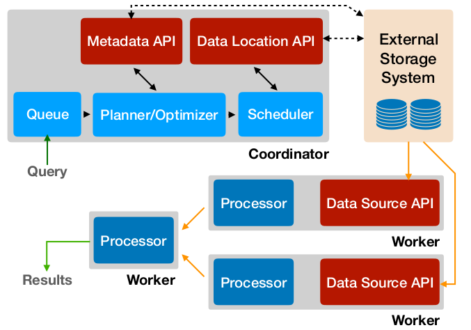

# Trino for SQD

## What is Trino?

Trino is a distributed SQL query engine designed to query large data sets distributed over one or more heterogeneous data sources.

Trino is **not** a general-purpose relational database. It is not a replacement for databases like MySQL, PostgreSQL or Oracle. Trino was not designed to handle Online Transaction Processing (OLTP). This is also true for many other databases designed and optimized for **data warehousing** or **analytics**.

Trino is a tool designed to efficiently query vast amounts of data using distributed queries. If you work with terabytes or petabytes of data, you are likely using tools that interact with Hadoop and HDFS. Trino was designed as an alternative to tools that query HDFS using pipelines of MapReduce jobs, such as Hive or Pig, but Trino is not limited to accessing HDFS. Trino can be and has been extended to operate over different kinds of data sources, including traditional relational databases and other data sources such as Cassandra.

Trino was designed to handle data warehousing and analytics: data analysis, aggregating large amounts of data and producing reports. These workloads are often classified as Online Analytical Processing (OLAP).

## Trino Concepts

* Cluster - A Trino cluster consists of several Trino nodes, one coordinator and zero or more workers. Users connect to the coordinator with their SQL query tool. The coordinator collaborates with the workers. The coordinator and the workers access the connected data sources. This access is configured in catalogs.

* Node - Any Trino server in a specific Trino cluster is considered a node of the cluster. Technically this refers to the Java process running the Trino program, but node is often used to refer to the computer running the process due to the recommendation to run only one Trino process per computer.

* Coordinator - The Trino coordinator is the server that is responsible for parsing statements, planning queries, and managing Trino worker nodes. It is the “brain” of a Trino installation and is also the node to which a client connects to submit statements for execution. Every Trino installation must have a Trino coordinator alongside one or more Trino workers.
Coordinators communicate with workers and clients using a REST API.

* Worker - A Trino worker is a server in a Trino installation, which is responsible for executing tasks and processing data. Worker nodes fetch data from connectors and exchange intermediate data with each other. The coordinator is responsible for fetching results from the workers and returning the final results to the client. Workers communicate with other workers and Trino coordinators using a REST API.

* Client - Clients allow you to connect to Trino, submit SQL queries, and receive the results. Available clients are listed [here](https://trino.io/docs/current/client.html).

* Connector - A connector adapts Trino to a data source such as a data lake using Hadoop/Hive or Apache Iceberg, or a relational database such as PostgreSQL. You can think of a connector the same way you think of a driver for a database. It is an implementation of Trino’s service provider interface (SPI), which allows Trino to interact with a resource using a standard API.

The following diagram (taken from [this paper](https://trino.io/Presto_SQL_on_Everything.pdf)) provides an overview of the architecture: 

 

External storage systems need to implement three APIs, two in the coordinator, one in workers:

* The metadata API provides information about existing entities in the data source, namely schemas, tables, columns and so on.

* The data location API (a.k.a. _SplitManager_) responsible for matching queries to a specific location in the data source including table chunks.

* The data source API retrieves data ("record sets" or "pages") from the data source according to their location.

## Trino - SQD Mapping

The mapping _Coordinator_ &#8660; _Portal_ and _Worker_ &#8660; _Worker_ suggests itself.

The dialog between Coordinator and Portal involves some iterations. The Coordinator, in particular, _asks_ the metadata API which pushdowns can be handled on the other side, such as limits, projections, filters, sorts, joins, _etc._ The connector implementation should be prepared to receive such questions multiple times during the planning phase.

The split manager partitions the data for a table into the individual chunks that Trino distributes to workers for processing. For example, the Hive connector lists the files for each Hive partition and creates one or more splits per file. In our case, the split manager (_i.e._ the Portal) would respond with the worker endpoints responsible for the respective data ranges.

Given a split, a table handle, and a list of columns, the record set provider, part of the data source API, is responsible for delivering data to the Trino execution engine. The provider creates a RecordSet, which in turn creates a RecordCursor that is then used by Trino to read the column values for each row.

## Uncertainties

Since I could not yet find an example that corresponds directly to our use case, that is, where worker nodes feed data into the data source API, I am not sure how complex that is. The simple examples that are usually highlighted in the documentation, naturally, look very simple. I need to study more complex connectors like Hive, for instance.

## Trade-off Trino vs. DuckDB Extension

### Advantages of Trino:

* Trino provides advanced features for query optimisation and scheduling of concurrent queries; for us to reach a comparable level will take many months;

* Trino already handles query plan management; we still have to do some work for pushdowns on the data provider side but that is certainly less work than implementing everything from scratch.

* Trino's architecture appears to be a good fit to our architecture.

### Risks and Drawbacks of Trino:

* The strong points of Trino come with the architecture as a whole; we cannot easily cherry-pick features we like and leave others out. We take it or leave it. There is the risk that we have to live with shortcomings that may hurt on the long run.

* There is in particular the issue of fault tolerance. With the coordinator the architecture introduces a single point of failures. Documents claim that this issue was addressed, but it is not clear to me, how it was addressed. Some more investigation is needed!

* We have to rethink reusability; the data sources needed to be designed so that they can additionally serve as the main query engine;

* Java is clearly drawback - it introduces an entirely different ecosystem that must be managed by the team, some Java expertise is necessary to implement the interfaces to external data sources and the GC introduces issues of time predictability. 

### Advantages of the DuckDB Extension

* We control the engine as a whole, design decisions remain in our hand;

* The development of the extension as such may be less work than implementing the Trino APIs (but the extension alone is not yet the query engine, see below);

* C++ is much more predictable in terms of processing time;

* C++ also introduces less disruption in terms of managing an additional ecosystem. (Personal remark: I have worked a lot with Java in the past, but I definitely need to catch up with modern Java.)

### Risks and Drawbacks of the DuckDB Extension

* The extension is not the query engine; for building the whole thing more work is necessary. In particular, we need to manage the query plan and the query pipeplines ourselves;

* It will take a long time and, certainly, a lot of trial and error to reach the level that we get for "free" with Trino;

* Trino is an active development community that not only fixes bugs but also adds new features at a pace that we cannot match.

### Conclusion

To go with Trino implies that we need to swallow some bitter pills, in particular Java, uncertainties related to fault tolerance and the risk of being locked into an architecture that is not under our control. However, with Trino we can, within a few of months, reach a level of performance and stability that would not be realistic with an internal development based on DuckDB. Furthermore, Trino is supported by a community of expert that we currently cannot match. In conclusion, it appears to me to be insane not to give Trino at least a try. If it turns out to be a suboptimal solution, we would lose a couple of months in the worst case. If it turns out to be a success, we save many more months of effort and we reduce risks relying on an experienced development community.
 

 

