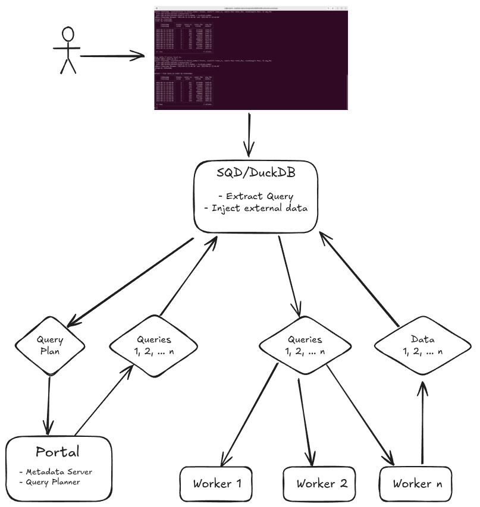
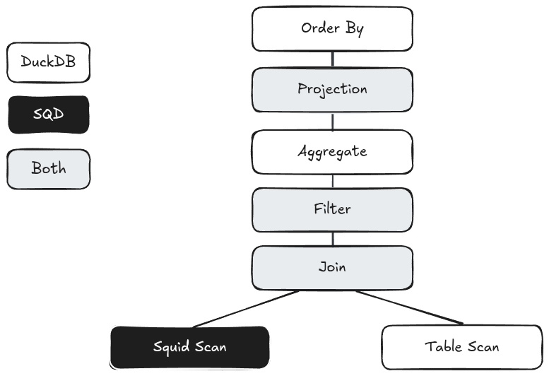
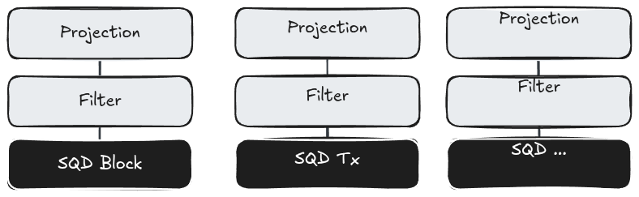
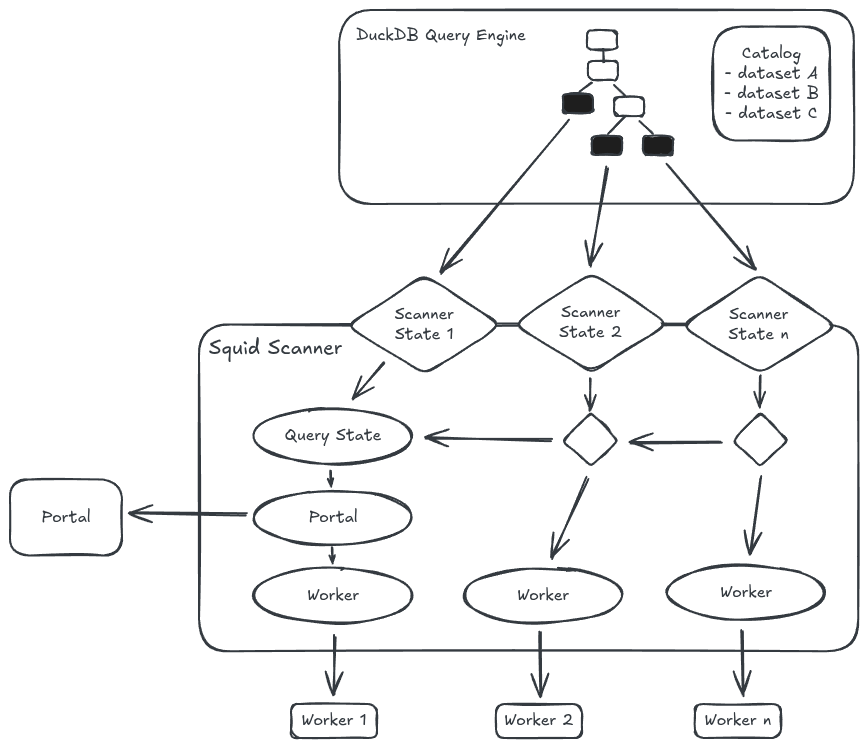

# SQL Engine and DuckDB Extension Design

## Intro

This document presents a report on what was achieved during the first iteration defined in [DuckDB-Extension Roadmap](https://github.com/subsquid/specs/blob/main/sql-research/2025-05-12-duckdb-timeline.md). The document discusses, in particular, the overall design of the **Squid Query Engine** (SQQED) and the role and internal design of the DuckDB extension. During the discussion, I will mention pending tasks, bugs and future improvements that I will then compile into a TODO list. The document concludes with a suggestion for a roadmap for further development with the overall goal to have SQL core functionalities in production still in 2025.

## Overall Design

SQQED consists of five components:

* DuckDB

* The Squid Catalog and Scanner (a DuckDB Extension)

* Plan (a query planning library written in Rust and to be integrated into SQD Network, SQD Portal and Worker)

* Portal components (metadata server and query planner)

* Worker components (query executor).

The following diagram shows the overall interaction of these components in processing a query (the metadata server is left out for simplicity):

<p align="center">
 
</p>

The first important entity to note is the user in the top-left corner of the diagram. Without users that actually see an advantage in the engine for their own work, there won't be an engine. This sounds trivial - but I will actually come back to it. Some effort is, in fact, still needed to make the engine attractive for users in *different* use cases, such as batch processing, currently the core functionality, but also for ad-hoc, explorative queries from the DuckDB CLI (or another interface). The latter, I believe, is a strong argument for the use of SQL in general and, arguably, the first step of any data scientist looking at a new set of data.

The query is passed through the CLI to DuckDB, which parses the SQL string and invokes the planner that transforms the query into a tree of tasks consisting of sorting, grouping, projecting, filtering, joining and, at the leaves of the tree, table (or index) scanning. When the DuckDB planner sees in the catalog that a scan relates to a SQD table, the Squid scanner is invoked. The scanner extracts the query plan, transforms it into another format (namely, *substrait*), serialises this format and sends it to the SQD Portal. The Portal responds with a set of subplans that are split per table and worker. The scanner, in turn, posts the subplans to the indicated workers and processes the result streams.

From DuckDB's perspective the only task that the scanner performs, is to somehow produce the data corresponding to the underlying entity denoted by *Squid Scan*, and this is, indeed, how, for example, the Posgres scanner for DuckDB works: the Postgres table appearing in DuckDB is just a table. What the scanner does in this case is just to query this table in Posgres and to inject the data into DuckDB's query processing. The Squid scanner is unique in that it, additionally, has to coordinate the query. SQD is not a single stand-alone database but a data lake. I will discuss the implications in the next section.

A scanner extension is basically a description of the work share between the standard DuckDB query engine and the external system. The following diagram illustrates that by means of a query plan:

<p align="center">
 
</p>

Most tasks, like grouping for example, are performed by the DuckDB query engine. The only task that is exclusively performed by the scanner extension is to produce data for the external data source. This alone is, obviously, inefficient for most cases. The scanner would always produce all columns of all rows. The projection is therefore *pushed down* to the data source to reduce the columns, and filters, *i.e.* parts of the *where* condition, are pushed down to reduce the number of rows; joins, likewise, act as implicit mutual filters for the tables involved and should be applied at the source. For a data lake such data reduction is essential, otherwise any query would produce billions of rows.

The Squid Scanner sends the entire plan to the portal. The portal extract the relevant parts from the plan and creates subplans for individual workers according to the assignment of chunks. A query that involves several SQD tables would, hence, produce several subplans. In fact, since tables are split in chunks, even one table would produce more than one subplan, one such plan for each affected worker. The following diagram illustrates subplans derived from a DuckDB query plan: 

<p align="center">
 
</p>

The subplans are sent back to the extension from where they are finally posted to workers.

At the moment **only projections** are extracted from the plan. We still have to implement filter and other pushdowns. The next section will discuss this aspect in more detail.

### Alternative

There is an alternative to this design. The obvious drawbacks of the approach described above are that

* We need to handle all SQL clauses known to Duckdb (*e.g.* inserts and updates that contain subqueries)
* We need to manage the overall query state which, indeed, is a bit awkward
* The Portal code will become quite complex, especially when we need or want many optimisations.

All of these downsides go away when we handle queries on the level of individual scanners, *i.e.* per table. We would push down filters to the scanners, a feature that DuckDB already supports; scanners would then receive exactly those filters relevant for the table they handle. It would then be the scanner that sends a query plan to the Portal. This plan is much simpler than the overall query plan because it contains only one table and, with that, the Portal code can be simpler. We, further, don't need to transform the entire query to a substrait plan, but only those parts that are relevant for the related table and those parts contain only a small subset of SQL.

The disadvantages of the alternative are:

* We need to send more than one request to the Portal, namely one per SQD table in the whole query.
* The Portal does not see the entire query and we, hence, lose a lot of optimisation opportunities.

The first drawback is minor. The number of tables in a query is limited and such is the execution time. The second point, however, is more serious. The following query, for example, will be problematic forever:

```sql
select ...
  from sqd.solana_mainnet.block b join sqd.solana_mainnet.transactions t on b.number = t.block_number
 where b.timestamp between '...' and '...'
``` 
For joins where the block number is part of the `where` clause, DuckDB converts the join condition to a filter on the transaction table. That is exactly what we want! But for the statement above, there is no way for DuckDB to know how block numbers and timestamps are related. If we want to optimise such queries - and I believe that we do want that - we need a query coordinator analysing the whole query. That is revelant even for the case where the block number is part of the `where` clause. Since the Portal does not know that the two queries are related, it cannot take advantage of locality. It will indicate different sets of workers for the same chunk.

## DuckDB Extension

The DuckDB extension has two main parts: *catalog* management and the *scanner*. The first makes SQD metadata available to DuckDB through the catalog interface, the second implements the query engine described in the previous sections.

### Catalog

DuckDB, like other relational databases, has a three-level data dictionary consisting of

* Catalog, the top level entry of a database's data dictionary;

* Schema, organising subsets in a catalog;

* Schema Entry, any database object like tables, types, views, stored procedures and so on within a schema.

The SQD extension implements the *attach* function that *attaches* an external resource to DuckDB:

```sql
attach 'http://127.0.0.1:5000' as sqd (type squid);
```

Here the user attaches a local SQD Portal to the alias `sqd` (which could be anything). In the future it will be also be possible to attach a specific schema, *i.e.* dataset:

```sql
attach 'http://127.0.0.1:5000' as sol (type squid, schema 'solana_mainnet');
```

The function posts a request to the metadata server, part of the Portal. The server answers with a JSON document describing all available datasets as schemas including their entries, for example:

```json
{
    "name": "solana_mainnet",
    "tables": [
        {
            "name": "block",
            "schema": {
                "fields": [
                    {
                        "name": "number",
                        "type": "integer",
                        "nullable": false
                    },
                    {
                        "name": "hash",
                        "type": "varchar",
                        "nullable": false
                    },
                ]
            },
            "partitionKey": [],
            "chunks": [],
            "stats": {
                "approx_num_rows": 1024
            }
        },
    ]
}
``` 

Currently, metadata are defined in a static file that is loaded by the portal (in fact: compiled into the code) and sent as response to a request to the metadata endpoint. In the future, a more dynamic approach will be needed to reflect frequently changing data like stats and chunks. Statistics are needed to report progress to DuckDB and, in the future, to implement more sophisticated optimisations.

Once the SQD network is attached, DuckDB makes all this information available through the normal catalog facilities, *e.g.*:

```sql
select * from information_schema.schemata where catalog_name = 'sqd';
```

| catalog_name | schema_name            | schema_owner | ... | 
|--------------|------------------------|--------------|-----|
| sqd          | etherum_sepolia_1      | duckdb       | ... |
| sqd          | hyperliquid_testnet_4  | duckdb       | ... |
| sqd          | solana_mainnet         | duckdb       | ... |

```sql
select * from information_schema.tables where table_catalog = 'sqd' and table_schema = 'solana_mainnet';
```

| table_catalog | table_schema   | table_name   | ... | 
|---------------|----------------|--------------|-----|
| sqd           | solana_mainnet | block        | ... |
| sqd           | solana_mainnet | transaction  | ... |
| ...           | ...            | ...          | ... |

```sql
desc sqd.solana_mainnet.block;
```

| column_name | column_type | ... | 
|-------------|-------------|-----|
| number      | INTEGER     | ... |
| hash        | VARCHAR     | ... |
| ...         | ...         | ... |

### Scanner

The scanner works in tandem with the DuckDB query engine. It is invoked for every attached resource used within a query which, for the SQD network, is always a table. The following diagram llustrates the interaction with some more detail:

<p align="center">
 
</p>

The main interface between DuckDB and the scanner is the scanner state. The internal design of this object is defined by the extension; the life cycle, however, is managed by DuckDB, which calls functions to create and initialise the state and to invoke the scanner with a state object. There is one such state per SQD table that appears in the query.
For illustration, here are the signatures of the initialiser and the scanner entry points:

```cpp
unique_ptr<GlobalTableFunctionState> SquidInitGlobalState(ClientContext &context, TableFunctionInitInput &input);
void SquidScan(ClientContext &context, TableFunctionInput &data, DataChunk &output);
```

where `TableFunctionInput` contains the previously created `GlobalTableFunctionState`, the state of this particular table scan, and `DataChunk` is the interface through which DuckDB receives the scanned data.

The first time the initialiser is invoked, the extension sets up the overall *query state* valid for all SQD scans in the scope of this specific query which is stored in the *ClientContext*. During this initialisation, the extension is completely locked. No concurrent initialiser can overtake the first and set up an alternative truth. Once the query state is set, initialisers pass and pick up the resources that correspond to the table for which they are responsible. The query state contains (among others) the following resources:

* Open connections to all workers

* Data (per worker) that would enable a scanner to retry a connection in case of failure (URL and query plan)

* The projection (per table): a list of columns, their types and positions in the output. 

During the initialisation process, the initialiser extracts the query plan from the DuckDB `ClientContext`, transforms and serialises it and sends it to the portal. The response, as already discussed above, consists of the subplans for all tables, which are then posted to the workers resulting in datas streams.

One qualification concerning the current state: the portal does not send, in fact, query plans but rather SQL strings. The reason for that is merely pragmatic. The `C++` substrait library which I use as a starting point is immature. Already now it poses restrictions on the SQL functionality we can support. Before extending the use of this library, namely for incoming substrait plans, I want to make sure that it is complete and sufficiently robust. That, however, is at least a two-weeks effort.

### Implementation Details

Currently, almost everything dealing with plans is implemented in the Portal. The rationale is that

* This kind of code is much easier written in Rust than in `C/C++`

* The DuckDB substrait library is somewhat poor (as mentioned above), I don't want to rely on it too much for the time being

* I want to avoid duplicating the planning code.

Improving the substrait library will be a a task in the near future, but it will accompany us for still some time. A comparison of library versions showed ad-hoc changes with impact on the plan structure which would cause rewrites of our planning library. Therefore, we should take responsibility for substrait and treat it as *our* code, part of the `squid extension`. I already 
had to extend and repair the library, in particular to consider the `SquidTableScan` node, which, of course, was not known to substrait, and to correct the implementation of some SQL constructs such as `distinct` and `count(*)`, which both caused DuckDB to crash. Currently three feautres are still missing:

* Complex Types like arrays and structs that are actually used in the SQD datamodel

* Subqueries - this omission is especially painful because without subqueries a whole family of problem solving tools is taken away from SQL

* Update - this is a minor issue and depends on subqueries. We are not interested in `update` as such, but in expressions like `update a set x = select ...`

Currently, workers send results as `newline`-separated JSON streams, while what we want is the `arrow` format. The reason is, again, entirely pragamatic. Sending and receiving a JSON stream is a no-brainer both in Rust and `C/C++`. How to receive arrow streams in DuckDB, I still have to figure out. 

The subplans sent from the Portal to the extension as response to a query request are of the following form:

```json
{
    "query_id": "sql-0c83d680-134f-4c19-a2cd-3ccb794a273e",
    "tables": [
        {
            "schema_name": "solana_mainnet",
            "table_name": "block",
            "workers": [
                {
                    "url": "http://127.0.0.1:5001/exec-query",
                    "sql": "select number, timestamp from block"
                }
            ]
        }
    ]
}
```

That implies that the scanner is not aware of chunks. The segments of a table may come from different workers, but for a number of chunks coming from the same worker one stream is expected. In other words, the worker needs to send all relevant data belonging to one table in one stream, *e.g.* creating a `union` of data read from various parquet files.

There are some more TODOs in the scanner implementation:
 
* The scanner does not implement retries.

* There is currently only one thread per table; in the future we want multi-threaded scans orchestrated by the DuckDB query engine. For this purpose we need a) to communicate to DuckDB how many threads are allowed for a specific scan and b) stats, in particular, how many rows we expect per scan. Currently I have added hand-written approximate row counts to the metadata. In the future we need a mechanism to keep such information up-to-date.

* Materialisation: I did not finish the implementation of materialised queries because they are somewhat delicate in the context of table scans. I preferred to have a working scanner ready before going down rabbit holes. However, it might be crucial for large data streams to support materialisation. (The DuckDB documentation is not clear on that point. But the mere existence of settings for materialisation in scans is a strong hint in that direction.) 

### Make it Efficient

The major tasks in the future, however, are related to query optimisation. We now have a close-to-complete query engine - in terms of strictly functional requirements, *i.e.*, SQL statements are properly processed in the client. However, we have a data lake. When we leave everything difficult to DuckDB, we need all data in the client. If a dataset has one million blocks with thousand transactions each, we will receive one billion rows for every query involving transactions. A simple `count` would cause a tsunami of data coming down on DuckDB. We have finished the technical mechanics of the engine. The really interesting work begins now.

The most urgent optimisation is *filter pushdown*. DuckDB has an interface to handle pushdowns, however, we need filters twice: in the Portal to restrict chunks and, thus, workers, and in the Worker, to restrict the blocks that are read from chunks. Extracting single conditions from filters as such is an easy task (especially in the Rust planning library). However, there are some subtleties, for instance:

```sql
where (block_number between a and b) or (timestamp between x and y)
```

Here, the block numbers must **not** be used in the portal to restrict workers and chunks. The `or` operator should always be considered a barrier in the filter tree traversal. Likewise `not` needs special attention. On the worker side such issues are much easier. The worker code already uses `polars` expressions to read data from parquet files. It is only a matter of applying the given `where` condition on the relevant subset of chunks. The intelligence, with this approach, is entirely in the Portal. Workers, hence, are blue-collar employees: they do the heavy lifting.

Low hanging fruits for optimisation are simple queries that contain only one table. In this case, all filters can be applied on worker side without second thoughts.

As a side note, I believe that data scientist are often interested in time series. That makes timestamps a privileged citizen in our data model. It would be extremely interesting to have a search structure in the Portal that converts time ranges into ranges of block numbers.

To efficiently provide interactive, ad-hoc queries, limits should be handled on worker-side when possible. But, as with filters, limits are subtle. The following polars expressions are **not** equivalent:

```
block.take(10).join(transaction, col(number), col(block_number))
block.join(transaction.take(10), col(number), col(block_number))
block.join(transaction, col(number), col(block_number)).take(10)
```

Suppose the block dataframe contains 50 rows to each of which correspond 100 transactions. Then these expressions will produce

* 1000 lines
*  500 lines
*   10 lines

In more general terms, all kinds of aggregates are hard to crack. When we *push down* aggregates to workers we just aggregate the wrong thing. Imagine a `count`: it would retrieve one row. DuckDB will, hence, conclude that there is only one row in the table. But without any pushdown mechanism, counting will be an extremely costly operation. I propose a research activity on how to solve such issues. One solution may be helper functions, *e.g.* `sqd_count`, that are passed to the workers. Since DuckDB is not aware what to do with such a function, it will just present the result instead of applying a special logic as in the case of an ordinary `count`.

A similar is true for joins. Joins are implicit filters and can reduce data right at the source. An SQD-specific table function of the form `sqd_join(left, right, condition)` could be useful, at least for the most frequent joins, that is, *left inner joins*.

## Roadmap

The following table lists pending tasks and future research activities with an effort estimation and a milestone. The tasks and activities are briefly described below.

| Task                  | Where\* | Effort (h) | Finished | Milestone | Owner | Comment                     | Achieved |
|-----------------------|--------|------------:|----------|-----------|-------|-----------------------------|----------|
| Code Improvement      | X      |  32         | 31/07/25 | M-1       | TS    |                             |          |
| Filter pushdown       | X+P+W  |  32         | 15/08/25 | M-2       | TS    |                             |          |
| Minor optimisations   | X+P+W  |  24         | 15/08/25 | M-3       | TS    |                             |          |
| Worker integration    | W      |  40         | 15/08/25 | M-3       | DK    |                             |          |
| Arrow not JSON        | X+W    |  32         | 31/08/25 | M-4       | TS    |                             |          |
| SQL completion        | X      |  80         | 15/09/25 | M-6       | TS    |                             |          |
| Substrait not SQL     | X+P    |  24         | 30/09/25 | M-7       | TS    |                             |          |
| Portal integration    | P      |  80         | 30/09/25 | M-8       | DK    |                             |          |
| More testing          | X+P+W  |  40         | 15/10/25 | M-9       | TS    |                             |          |
| Retry                 | X      |  24         | 30/10/25 | M-10      | TS    |                             |          |
| Multi-threaded Scan   | X      |  24         | 30/10/25 | M-11      | TS    |                             |          |
| Special functions     | X+P+W  |  40         | 30/11/25 | M-12      | TS    |                             |          |
| Experimental roll-out | N/A    |  N/A        | 15/12/25 | M-13      | DZ    |                             |          |
| Metadata handling     | P      |  N/A        | N/A      | N/A       | N/A   |                             |          |
| Local joins           | X+P+W  |  N/A        | N/A      | N/A       | N/A   |                             |          |
| Timestamp to Blocks   | P      |  N/A        | N/A      | N/A       | N/A   |                             |          |
| Overall               |        |  472        | 31/12/25 |           |       |                             |          |


\* The acronyms mean:

* X: DuckDB Extension

* P: Portal

* W: Worker

### Tasks and Milestones

#### Code Improvement

The extension code (`C/C++`) needs some clean-up and review. There is still code taken from the Postgres extension that is not used, and there are some ad-hoc solutions that should be properly implemented. I should also run static analysers to reduce the risk of memory leaks and dangling pointers.

In the course of this task, the query materialisation shall be finished.

Milestone M-1:

* Code should be clean. **Validation**: perform a code review.

* No memory leaks or other memory defects. **Validation**: static analyser report, dynamic analysis with valgrind or other memory debuggers.

* Query materialisation working. **Validation**: test.

#### Filter pushdown

The Portal extracts block numbers to reduce chunks and workers. Workers apply filter on their local chunks.

Milestone M-2:

* Test filter pushdown against an instance without pushdown, the results shall match, the performance of filter pushdown shall be better. **Validation**: test and benchmark. 

#### Minor optimisations

A simple means to accelerate queries is to push all filters to workers when only one table is involved. There may be other simple optimisations, which should be described in a report for future implementation.

Milestone M-3:

* Filters in one-table queries should always be pushed down to workers. **Validation**: benchmark.

* Report on future optimisations. **Validation**: RTFM.

#### Worker integration

Integrate worker-side code into the SQD worker implementation. Queries can be performed with the subset of workers that integrate this code and a local fake portal. When this milestone is reached, the query engine can be used internally for tests and experiments. A small dataset or a subset of dataset should be used for that purpose.

Milestone M-4:

* Workers shall produce the expected data. **Validation**: code review, test, experiments.

#### Arrow not JSON

Replace newline-separated JSON streams with arrows.

Milestone M-5:

* The results with arrow and JSON are equivalent, the performance with arrow is better. **Validation**: test and benchmark.

#### SQL completion

The extension correctly supports

* Complex Types (at least arrays and structs)

* Subqueries

* Updates

Milestone M-6:

* The extension performs queries with complex types, subqueries and updates correctly. **Validation**: test.

#### Substrait not SQL

The Portal sends substrait plans instead of SQL strings.

Milestone M-7:

* The extension handles substrait plans correctly. **Validation**: test.

#### Portal integration

The portal code, both for the metadata server and the query planner, is integrated into the SQD Portal.

Milestone M-8:

* The portal can now be used as an integral part of the SQD Network. **Validation**: code review, test, experiments.

#### More testing

This is, obviously, a work in progress. Tests will be developed over the time with new features added to the query engine. At some time, however, we should make sure that the test environment is capable of supporting a robust regression test battery and that this battery is complete.

Milestone M-9:

* Completed test environment. **Validation**: code review.

* Complete test battery. **Validation**: test coverage, fault injection tests.

#### Retry

When connections fail, they should be retried before giving up.

Milestone M-10:

* Failed connections are retried. **Validation**: code review, test.

#### Multi-threaded Scan

Scans should be able to use more than one thread. How many they actually use, depends on DuckDB. The code must, in particular, allow concurrent access to shared state (global scanner state and overall query state). The use of more than one thread should not lead to a performance degradation.

Milestone M-11:

* The code should not introduce deadlocks or race conditions. **Validation**: code review, static and dynamic analysis, test.

* Multithreading shall not lead to performance degradation. **Validation**: benchmark.

#### Special functions

The purpose of this task is to investigate other means to perform task on worker side instead of loading data down to the client. A starting point is the idea to use special functions like `sqd_count' and other aggregates. A proof-of-concept shall be provided.

Milestone M-12:

* The proof-of-concept demonstrates that at least one kind of aggregate is performed locally when possible. **Validation**: code review, test, benchmark.

* Report on further optimisations in this line.

#### Experimental roll-out

The query engine is made available for external use on some datasets. The query engine is publicly announced.

We should decide how to distribute the client at this point. It may be

* a binary distribution with an embedded extension
* a community extension that is installed by users.

With the first approach **we** control version manage (*e.g.* the DuckDB versions we support) and the extension is handled as our proprietary code. With second approach we make the code available on a public github repository, but we have less responsibility ind version management. 

#### Metadata handling

Metadata must be handled dynamcially; they should, in particular, contain table statistics.

#### Local joins

Enable local joins on workers. This may be achieved with table functions similar to aggregates.

#### Timestamps to Blocks

Implement a search structure in the Portal that converts time ranges to block number ranges.

