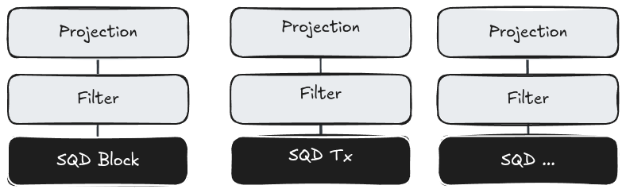

# SQL Engine and DuckDB Extension Design

## Intro

This document presents a report on what was achieved during the first iteration defined
in [DuckDB-Extension Roadmap](https://github.com/subsquid/specs/blob/main/sql-research/2025-05-12-duckdb-timeline.md).
The document discusses, in particular, the overall design of the **Squid Query Engine** (SQQED)
and the role and internal design of the DuckDB extension. During the discussion, I will mention pending tasks,
bugs and future improvements that I will then compile into a TODO list. The document concludes with a suggestion for a roadmap for further development
with the overall goal to have SQL core functionalities in production still in 2025.

## Overall Design

SQQED consists of five components:

* DuckDB

* The Squid Scanner (a DuckDB Extension)

* Plan (a query planning library written in Rust and to be integrated into SQD Network, SQD Portal and Worker)

* Portal components (metadata server and query planner)

* Worker components (query executor).

The following diagram shows the overall interaction of these components in processing a query (the metadata server is left out for simplicity):

 

The first important entity to note is the user in the top-left corner of the diagram. Without users that actually see an advantage in the engine for their work, there won't be an engine.
This sounds trivial - but I will actually come back to it. Some effort is, in fact, still needed to make the engine attractive for users in *different* use cases,
such as batch processing, currently the core functionality, but also for ad-hoc, explorative queries from the DuckDB CLI (or another interface).
The latter, I believe, is a strong argument for the use of SQL in general and, arguably, the first step of any data scientist looking at a new dataset.

The query is passed through the interface to DuckDB, which parses the SQL string and invokes the planner that transforms the query into a tree of tasks
consisting of sorting, grouping, projecting, filtering, joining and, at the leaves of the tree, table (or index) scanning.
When the DuckDB planner sees in the catalog that the scans relate to a SQD table, the Squid Scanner is invoked.
The scanner extracts the query plan, transforms it into another format (namely, *substrait*), serialises this format and sends it to the SQD Portal.
The portal responds with a set of subplans that are split per table and worker, each subplan associated with the URL of the worker.
The scanner, in turn, posts the subplans to the indicated workers and processes the result streams.
DuckDB's perspective, the only task that the scanner performs, is to somehow produce the data corresponding to the underlying entity denoted by SQD table,
and this is, indeed, how, for example, the Posgres Scanner for DuckDB works: the Postgres table appearing in DuckDB is just a table. What the scanner does
in this case is just to query this table in Posgres and to inject the Posgres data into DuckDB. The Squid Scanner is unique as it, additionally, has to coordinate the query.
SQD is not a single stand-alone database but a data lake. I will discuss the implications in the next section.

A scanner extension is basically a description of the work share between the standard DuckDB query engine and the external system. The following diagram illustrates that:

 

Most tasks, like grouping for example, are performed by the DuckDB query engine. The only task that is exclusively performed by the scanner extension is to produce data for the external data source. This, obviously, is inefficient for most case. The scanner would always produce all columns of all rows of the data source. The projection is therefore *pushed down* to the data source to reduce the columns, and filters, *i.e.* parts of the *where* condition, are pushed down to reduce the number of rows. For a data lake this essential, otherwise any query would produce billions of rows. Joins, likewise, act as implicit mutual filters for the tables involved and should be made explicit and then applied at the source.

The Squid Scanner sends the entire plan to the portal. The portal extract the relevant parts from the plan and creates subplans for individual workers according to the assignment of chunks. A query that involves several SQD tables would, hence, produce several subplans. In fact, since tables are split in chunks, even one table would produce more than one subplan, one such plan for each affected worker. The following diagram illustrates subplans derived from a DuckDB query plan: 

 

The subplans are sent back to the extension from where they are finally posted to workers. At the moment only projections are extracted from the plan. We still have to implement the filter pushdown. In the future joins should also be considered. The next section will discuss both aspects in more detail.

## DuckDB Extension
### Catalog

### Scanner

 

### Implementation Details
- curl
- substrait (here: missing SQL features)
- json, sql and arrow
- worker + chunks
- retries
- multi-threaded scans

### Make it Efficient
- Portal extracts relevant blocks to filter out chunks!
- Worker handling local filters
- Filter pushdown in extension
- Apply limits, aggregates and filters when we have only one table (no joins)
- Research idea: sqd_functions, e.g. sqd_limit(...), sqd_count(...) that handle certain tasks on worker side
- Note timestamp!

## Roadmap
