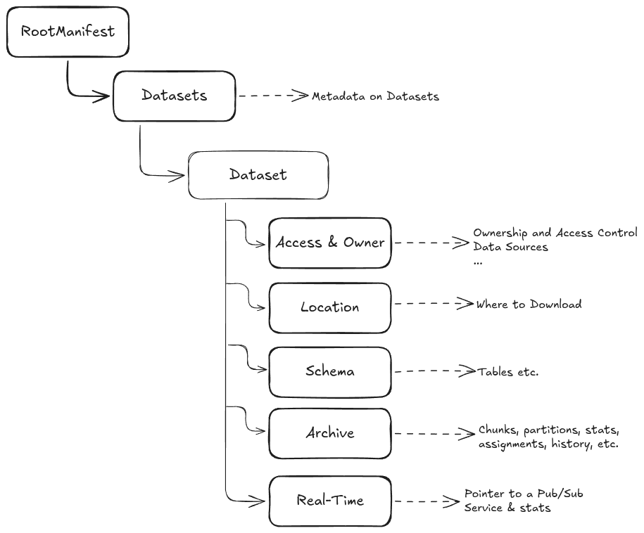

# Metadata

## 1. Purpose and Scope of this Document

This document represents a first iteration intended to initiate discussion on metadata 
for **generic data modeling** and **interoperability**.
It does not constitute a complete specification; 
instead, it identifies key topics and proposes possible approaches. 
In particular, the document discusses:

- [Overall Structure](3.1)

- [Schema definition](3.4)

- [Type system](3.5)

- [Keys and Indices](3.6)

- [Archive and Real-time data](3.7)

- [Statistics](3.8)

- [Format](4.)

Out of scope, for the moment are vector databases. 

## 2. Goals

The overall goals of defining metadata are to provide

- interoperability for **generic data** between different components
(portals, workers, SDKs, SQL tool integrations - such as the DuckDB extension)

- a **modeling facility** to define generic data in the first place. 

We are currently working with known and - to some extent - homogeneous data.
Generic interoperability is significantly harder.
We will need

- Unambiguous data definition

- Expressive power for data modeling. 

### 2.1 Long Term

In the long run, metadata may enable

- Validation on ingestion and data loading

- Parsing of data "for free"

- Automated ingestion

- Automated data transformation and Conversion

- Automated data repair

- Automated Export

- Data Generation

- Integration with standard tools

- Industry-standard modeling facilities.

### 2.2 Short Term

In the short run, particularly to implement the
[Proof-of-Product](https://github.com/subsquid/specs/blob/main/sql-research/2025-11-27-agents-pop-1.md)
the goals are less ambitious:

- Provide data modeling by means of hand-written metadata

- Interoperability rooted in such hand-written documents

- Hand-crafted ingestion pipelines

- Validation and Parsing of data for different components
(portals, workers, SDKs, the DuckDB extension).

For the first iteration we are currently working on, this means:

OUT OF SCOPE:
- IPLD
- schema-on-write
- real-time data
- generic keys

IN SCOPE:
- Basic set of statstics (can be computed once, since we have no real-time data)
- Block numbers as keys (done)
- Timestamps as keys (on the way)
- Complex data types
- Consistent error handling
- Better integration in Portal (use Portal datasets, keep datasets + schema in memory) 

## 3. Elements of Metadata

### 3.1 Assumptions

1. Schemas are (largely) immutable.
I say "largely" because the possibility for corrections and adaptations cannot be foreclosed.
The question is then whether such occasional changes should be automated or can be treated as mainenance.

1. Data are inserted and occasionally deleted, but never updated.

1. Data are stored in chunks.

1. Chunks consist of parquet files with related data; each parquet corresponds to one table (e.g. `blocks`, `transactions`, etc.).

1. New data (a.k.a. "hotblocks") are handled separately until a new chunk is ready and assigned to workers.

1. Data is always redundant (on s3, on more than one worker, etc.);
   no further backups are needed.

### 3.2 Elements and their Lifecycles

The structure of metadata as a whole may be:

<p align="center">
 
</p>

A dataset node contains the metadata describing all one dataset concerning

- ownerschip and access
- data location (e.g. s3)
- the schema
- the "archive", i.e. the chunks containing the data (including statistics)
- the "real-time" data (a.k.a. "hotblocks"), i.e. data before they are appended to a chunk. 

#### Access and Owner

This object contains the owner of this dataset (our datasets today would all have the same owner "Squid").
It also contains access information (public, private, etc.) and elements of access control.
It may contain additional routing information, indicating portals that should serve the dataset in question.
Datasets should be submitted only to the portals for which they are intended.

This node may change within the life of one dataset:
- when the owner changes (rare)
- when access information changes (more frequent)
- when routing through portals changes (frequent) 

#### Location

Locations from where data chunks can be downloaded (e.g.: an s3 bucket, a github repository, an ftp server).

This node may change within the life of one dataset:
- when new locations are added
- when locations are removed or updated

#### Schema

See [below](schema). 

This node may change within the life of one dataset with changes to the schema (shall be rare!).

#### Archive

Data concerning chunks:
- Statistics at dataset, table, row, and column level.

This node may change within the life of one dataset:
- Chunks are added (frequent)
- Statistics are recomputed (frequent)
- Chunks are reassigned (frequent) 

#### Real-Time Data

Data enter the database in "real-time" mode. They are at this point not part of any chunk.
They exist in a database that can be accessed by a portal and served directly from there.

The real-time node contains information about data sources and ingestion procedures.
The mechanism should generalise today's "hotblocks". For instance:
- A publisher address to which the portal subscribes;
- A stored procedure that is invoked with the data in question;
  this procedure may transform the data and should store them in "hotblock" database;
- A connect string for the local database.

This node may change within the life of one dataset:
- when the publisher or the ingestion process change (occasional).

### 3.3 Self-Certification

The whole metadata tree shall be self-certifiable in the sense that

- Its identifier cryptographically commits to its contents

- Any tampering is detectable without a trusted authority

- References between document parts are verifiable.

For details see below [IPLD](IPLD)

### 3.4 Schemas

A schema is a set of **integrity constraints** imposed on a set of data
that together forms a queryable unit of data.
In our terminology, such units of data are called **datasets**.

Integrity Constraints are formulas (recipes) that describe **structured data**.
They describe how data can be read from and written to **data stores** and
how they can be queried efficiently.

A query retrieves data, either in isolation or - more typically and more relevantly -
in combination according to its integrity constraints. How data can be meaningfully combined
is defined by **relations**.

Some relations are predefined in the schema, others are produced by queries.
Predefined relations are called **tables**.
Tables are the building blocks of data modeling.
They carry additional metadata, in particular **statistics**.

Relations are organised into **rows and columns**.
At present we don't exploit column-level metadata for retrieval or storage optimisation -
we rely on storage engines to provide these capabilities.
In the future, we may add statistics to columns or row groups
to accelerate ingestion and, in particular, retrieval.

Integrity Constraints are

- Types, which restrict the domain of data assigned to a column;

- Additional Column constraints (e.g. nullability);

- Keys (including **referential integrity constraints**)

**Keys** define internal relations between rows in a table;
They constrain column values across rows.
Keys are

- **Primary Keys** (PK) uniquely define one row in a table.
  A table has at most one PK;

- **Secondary keys** (SKs) are one or more columns whose values may repeat
  and are used to identify and retrieve sets of rows.
  A table may have zero, one, or many SKs.
  (Note: “secondary key” is not standard relational-algebra terminology.)

- **Foreign Keys** (FK) define a secondary key in one table
  that corresponds to the primary key in another table;

Note: multi-column key are possible and should not cause to much overhead.
But they have impact on memory requirements.

**Indices** are search structures defined over tables.
They are associated with keys.
(Indices are not part of relational algebra. They are tools to implement it efficiently.) 

Today, tables together with indices defined over them are the only predefined relations.
In the future, other types of relations and other objects may be considered, such as:

- Views

- Materialised Views

- Triggers

- Stored Procedures.

Schemas shall also include elements for defining real-time data.
This may include an endpoint from which data is read,
and a stored procedure (or equivalent processing step)
that transforms data and passes it on to an internal API.

The **lifecycles** of schemas and the data they describe are independent.
The same schema may be applied to multiple datasets.
Therefore, the principial metadata of a dataset is a reference to a schema.

Today we refer to a dataset's schema as its **kind**.
From the perspective of generic datasets, this term is unfortunate.
The natural term is schema.

#### Schema-on-Read or Schema-on-Write

In the long run, schemas shall be "on-write": data is validated and/or transformed to a fixed schema at ingestion time,
so all stored data conforms to that schema before it is written.
Reaching this goal will take bit of learning. In the short run, schemas will therefore be "on-read":
data is stored with minimal or no upfront structure - it is in particular stored **manually** -
and a schema is applied only when the data is read or queried.

Non-conforming data is either
- ignored
- converted to NULL (in case of an invalid column)
- flagged as error.
Which strategy is chosen depends on the context. For instance: the DuckDB extension converts unknown or non-conformant fields to NULL; 
DuckDB itself may reject data that do not conform to constraints defined in the catalog (e.g. NOT NULL, UNIQUE, etc.).

### 3.5 Types

Types restrict the domain of data that may be associated with a column.
Unlike types in programming languages, they don't imply how they should be outlined in memory.
The physical in-memory layout depends on how the specific language (or tool) interprets metadata.

The proposed **type system** is therefore **much simpler** than those found in modern programming languages.
In particular, it does not define a type hierarchy or generics and provides only minimal type semantics.
More advanced facilites can be delegated to surrounding languages and tools.

However, types indicate how data may be used.
Therefore, the **type name** shall support an intuitive understanding of the type's semantic.

Types are distinguished into **primitive types** and **complex types**.

Primitive types are defined in terms of

- Type name (mandatory)

- Size

- Unit

- Range

- Encoding.

A `uint8` can be defined as:

```json
{
  "name": "integer",
  "size": 1,
  "range": "0..255",
}
```

The unit of size is always byte. (Or is it more convenient to define integers and bit patterns in bit?)

A boolean:

```json
{
  "name": "bits",
  "size": 1,
}
```

A more involved example:

```json
{
  "name": "blockchain_timestamp",
  "size": 8,
  "unit": "second",
  "range": "1230940800..",
}
```

Fundamental types like `bool, `double` and integer variants should be built in.
For convenience, the system may support **type labels** to define common types.

Note: We can use the SI to predefine a meaningful set of units.
If we want to be crazy, we can implement the whole thing.

Base types are:

- Bit Pattern (`bits`), limit: 8 bytes

- Integer (`int`), limit: 8 bytes

- Floating Point Number (`float`), always 8 bytes

- Timestamp (`timestamp`)

- Char (`char`), one or more bytes, but always the indicated number of bytes. Encoded in UTF-8 by default. 

- String (`varchar`), one or more bytes, may vary within this range. Encoded in UTF-8 by default.

- Text (`text`), unlimited number of bytes encoded in UTF-8 by default.

- Blob (`blob`), unlimited binary object.

Complex Types are defined in terms of

- Type name (mandatory)

- Base type

- Size

- Precision.

Complex types are:

- Biginteger (`bigint`), integers with more than 64bit, arbitrary length.
  It can be restricted explicitly (and then corresponds to an array) or
  unrestricted (and then corresponds to a list), e.g.: `bigint` or `bigint(256)`;

- Arbitrary Precision Number (`decimal`), arbitrary size and arbitrary precision, e.g.:
  `decimal(10,2)`, `decimal(2)`;

- Array (`array`): `array(uint64, 1024)`;

- List (`list`): `list(uint64)`;

- Enum  (`enum`): `enum(A|B|C|D)`;

- Union (`union`): `union(A(typeOfA), B(typeOfB), C(typeOfC))`;  

- Structure (`struct`): `struct(a: typeOfA, b: typeOfB)`;

- Mapping (`map`): `map(typOfKey, typeOfValue)`;

- JSON (`json`).

#### Conversions

Metadata are used by

- Portals

- Workers

- Clients (e.g. DuckDB extension, SDKs)

- AI Agents

Type information therefore needs to be converted to different languages / tools:
Rust, C++, Typescript, Python, etc.

Strategies to deal with it include

1. A library in a language that can easily be integrated into other languages (i.e. ANSI C or Rust)

1. Native implementation for each language.

Note: The first option would be my choice for Rust, C++ and Python - but not for Typescript.

In any way it should be clear how to interpret types and the associated data, either by

- A detailed specification (which is hard for the general case.
If we know the set of languages, we can just indicate the target types and behaviour for each language.)

- A reference implementation. 

### 3.6 Keys and Indices

Today, we have only one _PK_ - block number -
which follows naturally from the predefined structure of blockchain data.
Chunk summaries held in memory enable portals to locate the relevant block ranges quickly.

This logic can easily be generalised to keys that **increase over time**
(and therefore with ingestion order).
Since this is by far the fastest way to locate data by key, schemas should
provide an indicator (e.g. a column modifier) for keys with this property.
Auto-increment keys, for instance, behave in this way.

With time-incrementing keys, a **timestamp search** index can be obtained almost for free.
The last timestamp in a chunk is part of our **chunk summary** and can therefore be used
to quickly locate a key range nearby. This yields a two-level lookup, but it is still fast in practice.

For PKs that are not aligned with time - and for all other indices -
we need **explicit search structures**.

I assume that datasets, although generic, can still be stored in chunks of reasonable size.
However, chunks may lose some of their performance advantages they have for our data
where they are organised into small hierarchies of related tables (_blocks_ - _transactions_ - etc.)

Note:
Datasets with many tables may need to be broken down into smaller sets of tables,
which would result in different kinds of chunks for the same dataset.
This can be modelled in terms of _subdatasets_.
These subsets must be defined by the user.

Generic chunks without time-increasing keys are not nicely aligned like our chunks.
Rather they contain **arbitrary collections** of keys. Today we may ingest the keys

`chunk_1: [1 5 9 3]`

Tomorrow we may have

`chunk_2: [8 2 7 6]`

In other words, chunks remain tied to ingestion time, whereas keys may not.

A reasonable approach is a **two-level key-to-chunk routing** structure.
At the top level, we compute a stable hash of the key and use a fixed-width hash prefix (e.g. 16 bits)
to map the key to a small set of candidate chunks.
This directory is compact, grows slowly, and bounds the expected number of candidate chunks per lookup to a small constant,
independent of the total number of chunks.

At the chunk level, we attach a space-efficient, static membership filter (e.g. a binary fuse, XOR, or ribbon filter) to each chunk.
These filters confirm key membership with low false-positive rates.
Combined with hash-prefix routing, the expected number of unnecessary worker probes can be kept low.

Note:
As the number of user datasets grows, we cannot keep all relevant data
(maps, assignments, chunks, etc.) in memory in a single portal. We will need
to **shard datasets across portals**.

We may also want to explore other kinds of indices, for example:
   
- Bitmap Index

- Zone Index

- Filters.

### 3.7 Archive and Real-Time Data

#### Archive

Archive contains all chunk-related data:

- The assignment file.
  Note: this is now implemented separately with flat buffers.
  I don't want to imply that it *must* be changed. Conceptually, it belongs to metadata.
  But as long as the data are available in portal, there is no need to change it.

- Chunk metadata (key range if applicable, timestamp range, size, number of keys)

- Statistics per table, chunk, column
  Alternative:
  Statistics could be applied directly to the tables in schema.
  That would avoid repeating the table information in the archive.
  On the other hand, by removing statistics from schema, it becomes slimmer and easier to use.

- Search structures for generic keys;
  Note: the document would most likely only point to a location from where
        the structures could be downloaded (e.g. s3);
        the portal would then store them locally.

#### Real-Time Data

I assume that the ingestion cycle for real-time data is as follows:

1. Receive data from a provider though an endpoint

1. Transform the data

1. Pass them on to a ingestion facility (e.g. in a local database).

We thus need:

- A set of endpoints from where to obtain the input

- A stored procedure (which is user-defined) to transform the input

- A library that stores real-time data (which is provided by us).

Relevant for metadata:

- The real-time shall contain the endpoint URL (or the set of URLs),
  the name of the stored procedure that processes and ingests the data,
  and information about the local database that stores the data. 

- Schemas shall provide the concept of **stored procedures**.

- The portal shall provide a mechanism to invoke stored procedures periodically or event-based.

### 3.8 Statistics

The purpose of statics is to enable

- Efficient queries

- Estimations of duration (for user's convenience)

Query engines (e.g. DuckDB) use statistics for **query planning**.
The engine may decide, for example, to download a small table (and possibly cache it persistently)
to execute joins more efficiently. Without estimates of table size that would not be possible.

For a user working with an interactive client, it is inconvenient not to know how long the query will take (10 seconds? 10 hours?).
Indicating an approximate duration (e.g. a progress bar) is extremely helpful. 

Relevant statistics are:

- Row count per table and chunk
  
- Row count per foreign key

- Cardinality

- Min/Max

- NULL count.

Unlike schema definitions, statistics **change frequently** and shall be refreshed periodically.
Portals shall provide an endpoint 

- from where updates on statistcs can be polled periodically or
  
- to which the portal can subscribe updates.

For the first iteration, statistics will be generated by the ingestion process and stored in plain JSON.
  
## 4. Metadata Format

### 4.1 JSON

At present, metadata is hand-written in JSON and contains only the information
required by the DuckDB extension.
Here is an [example](https://github.com/subsquid/sql4sqd-prototype/blob/main/charts/sql-central/config/ethereum_holesky_1.json).

### 4.2 SQL
I propose using SQL, in particular DDL, for schema management containing `CREATE|DROP|ALTER table_name...` statements.
User can then use DuckDB (or other SQL clients) to manage their schema.

Note:
Even if we consider schemas largely immutable, a way to correct and adapt schemas is necessary.

### 4.3 IPLD
TBD
